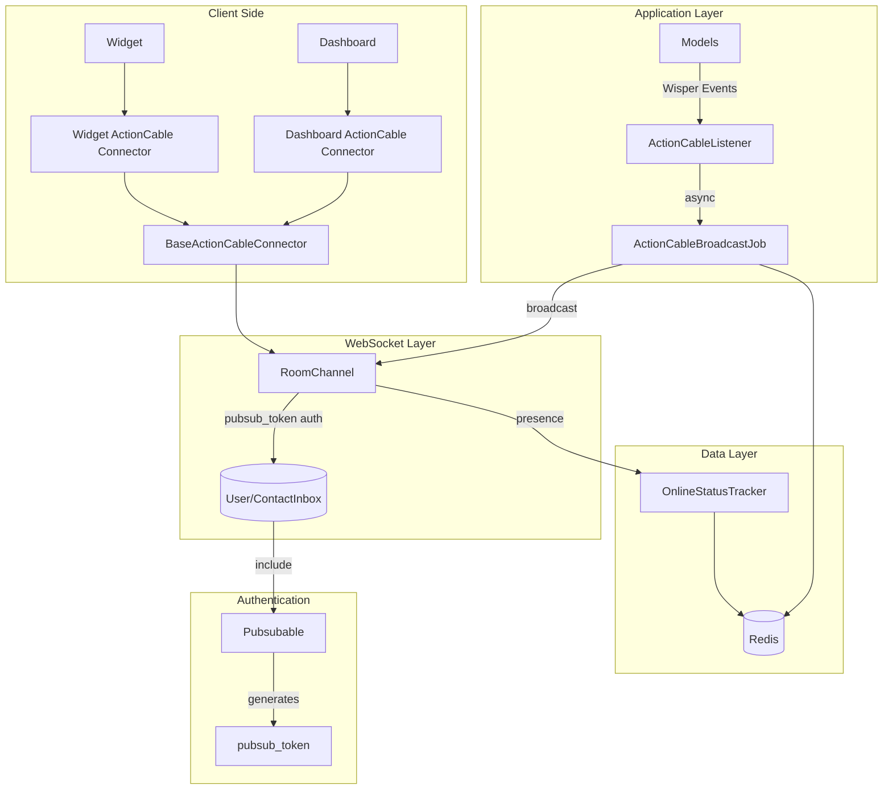

# ChatwootのActionCable アーキテクチャ全体像

## 🏗️ システム構成図



## 📊 データフロー詳細

### 1. メッセージ送信フロー
```
User Input → API Controller → Message.create → Wisper Event
    ↓
ActionCableListener.message_created → ActionCableBroadcastJob
    ↓
Redis Channel → ActionCable → WebSocket → Client
    ↓
BaseActionCableConnector.onReceived → Vuex Store → UI Update
```

### 2. プレゼンス更新フロー
```
Client Timer (20s) → RoomChannel.update_presence
    ↓
OnlineStatusTracker.update_presence → Redis Sorted Set
    ↓
RoomChannel.broadcast_presence → WebSocket → All Clients
    ↓
ActionCableConnector.onPresenceUpdate → Agent Status Update
```

### 3. 認証フロー
```
User/Contact Login → Pubsubable.pubsub_token generated
    ↓
Client connects with pubsub_token → RoomChannel.current_user
    ↓
User.find_by(pubsub_token) OR ContactInbox.find_by(pubsub_token)
    ↓
Stream subscription: [pubsub_token, account_#{id}]
```

## 🔐 セキュリティモデル

### pubsub_token設計思想
- **ユニーク性**: `has_secure_token :pubsub_token` で自動生成
- **ローテーション**: パスワード変更時に自動更新
- **スコープ**: User/ContactInbox単位で個別管理
- **期限**: 明示的な期限なし（パスワード変更まで有効）

### アクセス制御
- **チャンネルレベル認証**: Connection層は素通し
- **ストリーム分離**: pubsub_token毎に独立したストリーム
- **アカウント分離**: account_id による完全な分離

## ⚡ パフォーマンス最適化

### 1. 非同期処理
- **ActionCableBroadcastJob**: `queue_as :critical` で最優先処理
- **Sidekiq**: バックグラウンドでのブロードキャスト処理
- **データ新鮮性**: ジョブ実行時に最新データを再取得

### 2. Redis活用
- **ソートされたセット**: プレゼンス管理に最適化
- **TTL自動管理**: 古いプレゼンス情報の自動削除
- **チャンネルプリフィックス**: 環境別の完全分離

### 3. 接続管理
- **自動再接続**: 1秒間隔での接続状態チェック
- **プレゼンス維持**: 20秒間隔での生存確認
- **グレースフル切断**: 切断時のメッセージ同期

## 🎯 設計パターンの利点

### 単一チャンネル設計
- **利点**: 
  - 管理が簡単
  - pubsub_tokenによる効率的フィルタリング
  - 設定ファイルの最小化
- **トレードオフ**: 
  - 単一障害点
  - チャンネル別の細かい制御が困難

### イベント駆動アーキテクチャ
- **利点**:
  - 疎結合な設計
  - 機能追加が容易
  - テストしやすい
- **トレードオフ**:
  - デバッグが複雑
  - イベントの順序制御が困難

### チャンネルレベル認証
- **利点**:
  - ユーザー/ゲストの統一処理
  - 柔軟な認証ロジック
  - Connection層の簡素化
- **トレードオフ**:
  - 各リクエストでの認証処理
  - 認証失敗の制御が困難

## 🚀 スケーラビリティ考慮事項

### 現在の制限
- **単一Redis**: 全てのActionCableトラフィックが集中
- **単一チャンネル**: 負荷分散が困難
- **同期ブロードキャスト**: 大量ユーザー時のボトルネック

### 拡張性の工夫
- **GCP Memorystore対応**: クラウドRedisサービス対応
- **非同期ジョブ**: UI応答性を保つ設計
- **データ新鮮性保証**: 競合状態での整合性維持

## 🔍 監視・デバッグポイント

### ログ監視
- ActionCable接続/切断ログ
- WebSocketハンドシェイク失敗
- pubsub_token認証エラー
- Redis接続状態

### メトリクス
- 同時接続数
- プレゼンス更新頻度
- ブロードキャスト遅延
- メッセージキュー長

### トラブルシューティング
- **接続できない**: pubsub_token検証、Redis状態確認
- **メッセージが届かない**: Wisperイベント、ジョブキュー確認
- **プレゼンス不正確**: OnlineStatusTracker、Redis sorted set確認